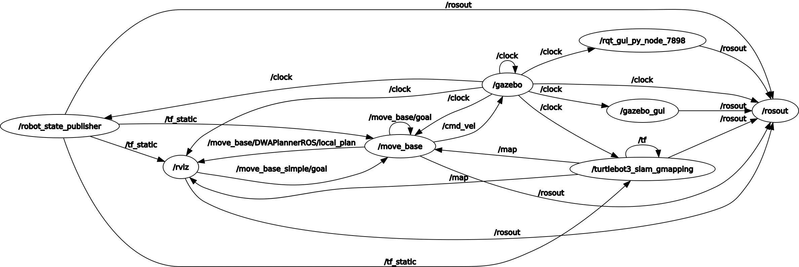
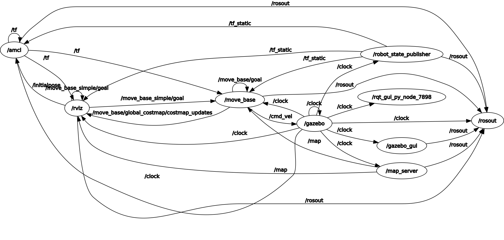
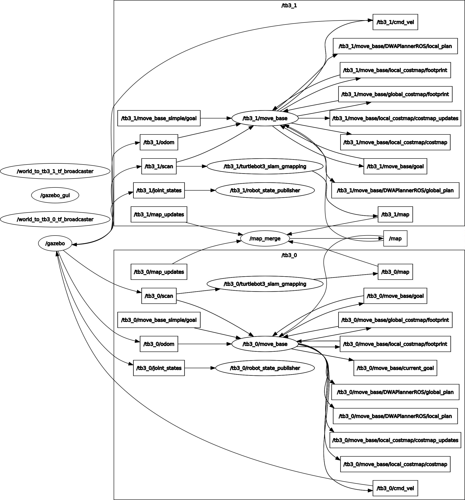
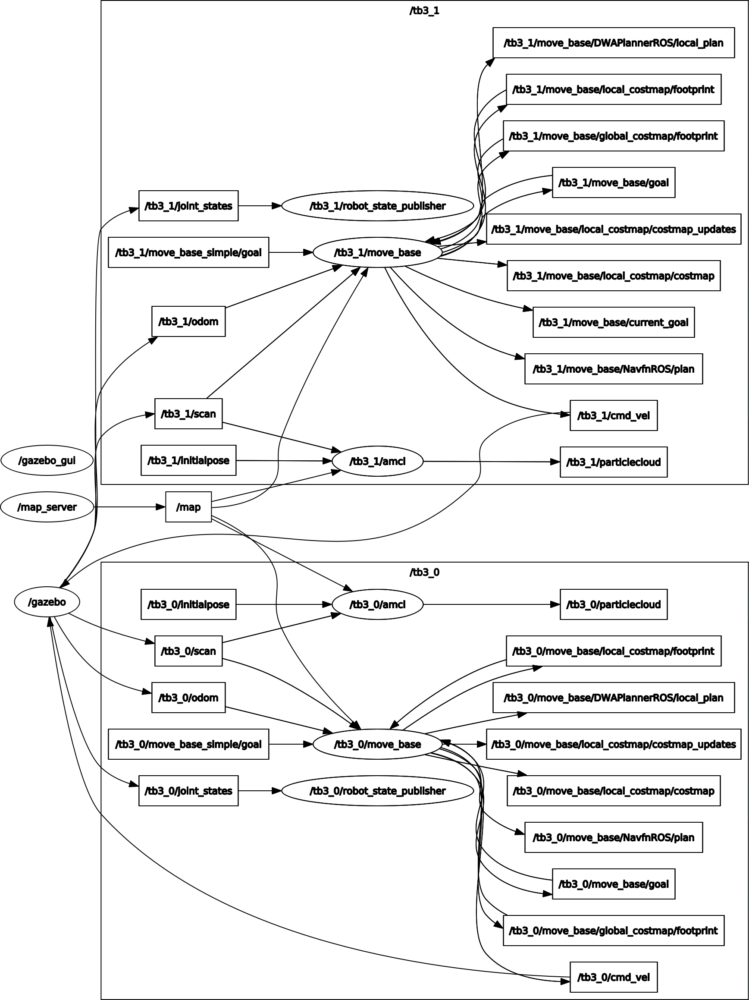

# ROS simulation

Please make sure the ros 2D navigation stack is properly installed. Use the command below to install.
`sudo apt-get install ros-melodic-navigation` (replace the melodic by your ros version).

Or install from [source](https://github.com/ros-planning/navigation).

Gmapping package is also required. To install gmapping
`sudo apt-get install ros-melodic-slam-gmapping`

Note that ROS noetic does not support the parameter `tf_prefix` in `robot_state_publisher` as discussed in issue [#125](https://github.com/ros/robot_state_publisher/issues/125). Therefore, the multi-robot SLAM and navigation launch files do not work in ROS noetic. There is a [pull request](https://github.com/ros/robot_state_publisher/pull/139) discussed. Hopefully the PR will be merged soon.

## Mapping in Gazebo

(1) Open the Gazebo simulation environment
`roslaunch ros_sim turtlebot3_world.launch`

(2) Run the SLAM nodes
`roslaunch ros_sim turtlebot3_slam.launch`

(3) Now we need robot to move around the unknown area and compute the occupancy map. A simple method to control the robot is to publish the twist message to topic `/cmd_vel` or use a teleop node. However controlling robot directly may cause the collision with the obstacle especially for people (like me) not comfortable with keyboard teleop. Here we use move_base node so that we can specify the goal pose by clicking on 2D Nav Goal button on rviz tool panel and move_base node can compute a safer velocity command based on the odometry and laser scan reading.

(4) Save the map after scanning every corner of the map.
`rosrun map_server map_saver -f ~/map`

The computation graph is shown as following

The gazebo node sends the laser scan information to gmapping node through topic `/scan`. The gmapping node computes and publishes the occupancy map through topic `/map`. By clicking the pose in rviz (treated as a hidden debugging node in the rqt graph), rviz node publishes a goal to move_base node by topic `/move_base_simple/goal`. Besides `/move_base_simple/goal`, move_base node also subscribes to `/scan`, `/odom` and `/map` (initially unknown). The move_base node computes and publishes the velocity command to robot (in gazebo node) through topic `/cmd_vel`. Following the velocity command, robot tries to reach the assigned goal without collision with obstacles.

## Navigation in Gazebo

(1) Open the Gazebo simulation environment
`roslaunch ros_sim turtlebot3_world.launch`

(2) Run the navigation nodes
`roslaunch ros_sim turtlebot3_navigation.launch`

(3) Specify the initial pose of robot by 2D Pose Estimate in rviz. This is used for initilizing the amcl localization node. It is not necessary to specify the exact initial pose because amcl node can adjust the robot's pose properly by laser scan.

(4) Specify the goal pose by 2D Nav Goal in rviz. Since the complete map is given to move_base node, a global path (black line) for robot to reach the goal can be computed.

Computation graph:

In the navigation, move_base node obtains the complete map published by the map_server node. Thus a global path beween robot and goal can be computed. The amcl node implements the particle filter to track the robot in the given map. By selecting the initial pose in rviz, the amcl node is initilized through topic `/initialpose`. It also subscribes to the laser scan through `/scan` topic for localization and publishes the set of the pose estimates through topic `/particlecloud` shown in rviz and the transform between map frame (reference frame) and odom frame(target frame) through topic `/tf`.

## Multi-robot mapping

Note: this example requires [multirobot_map_merge package](https://github.com/hrnr/m-explore). Please make sure the package and the dependencies are properly installed.

(1) Open the gazebo environment with multiple robots
`roslaunch ros_sim multi_turtlebot3_slam_world.launch`

(2) Run the multi-robot slam nodes
`roslaunch ros_sim multi_turtlebot3_slam.launch`

(3) Specify the goal poses for multiple robots. There are two 2D Nav Goal bottons in rviz. Each robot will be exploiting the unknown area and create its own map. The maps are published to the map merge node through topic `/tb3_#/map` (where # is the index of the robot).

(4) Save the map after every corner of the map is scanned by robots together.
`rosrun map_server map_saver -f ~/map`

Computation graph:

The difference between the single robot and multi-robot mapping is that each robot has a gmapping and move_base nodes under its namespace (i.e., tb3_0 and tb3_1). A map_merge node subscribes to the topic `/tb3_0/map` and `/tb3_1/map` published by each individual robot.

## Multi-robot navigation

(1) Open the gazebo environment with multiple robots.
`roslaunch ros_sim multi_turtlebot3_nav_world.launch`

(2) Run multi-robot navigation nodes.
`roslaunch ros_sim multi_turtlebot3_navigation.launch`

(3) Specify the initial poses of each robot in rviz. This step initialized the amcl node for each robot. It is ok to just specify the approximate poses.

(4) Specify the goal poses for each robot. The robot will move to the goal. By properly tuning the parameters of move_base node in param folder, robot is able to avoid the obstacles.

Computation graph:

Each robot has its own amcl node for localization, which is defined under the robot's namespace `tb3_0` and `tb3_1`. Therefore the amcl's published and subscribed topics are under the robot's namespace. Make sure `use_map_topic=true` so that the map is received by subscription instead of making a service call. And `remap from="map" to="/map"` so that all amcl nodes subscribe to the same global map published by the map_server node.

## Reference

* gmapping package: <http://wiki.ros.org/gmapping>
* move_base package: <http://wiki.ros.org/move_base>
* amcl package: <http://wiki.ros.org/amcl>
* tf introduction: <http://wiki.ros.org/tf>
* Setup and Configuration of the Navigation Stack: <http://wiki.ros.org/navigation/Tutorials/RobotSetup>
* Turtlebot3 simulation: <https://emanual.robotis.com/docs/en/platform/turtlebot3/simulation/>
* Multiple turtlebot3 mapping: <https://wiki.nps.edu/pages/viewpage.action?pageId=1018462212>
